  <picture>
    <source media="(max-width: 640px)" srcset="./assets/header-mobile-v2.svg" />
    
  </picture>

  

  
  &nbsp;
  

## 👋 A little about me

I'm **Naroz**, a front-end developer at **Sakneen** and an **ITI student**.
I work with **JavaScript, React, and Next.js**, and enjoy exploring new ways
to build for the web.

- 💻 Ask me about **React, Next.js, Node.js**, or web development.
- 🌱 Always learning, experimenting, and putting new ideas into practice.
- ☕ My ideal day starts and ends with a good cup of coffee.

## 🧩 Technologies I work with

  <picture>
    <source media="(max-width: 640px)" srcset="./assets/toolkit-mobile-v2.svg" />
    
  </picture>

## 🚀 Explore my work

Visit **[my portfolio](https://my-portfolio-lime-2.vercel.app/en)** to see the projects I've
worked on, or explore **[my repositories](https://github.com/narozezzat?tab=repositories)**
to take a closer look at the code.

---

  <strong>Let's talk code, ideas, and everything in between.</strong> 
  <a href="https://www.linkedin.com/in/naroz-ezzat-095370217/">Say hello on LinkedIn</a>

Built with curiosity. Fueled by coffee.

<!-- Technology logos: Devicon (MIT), https://github.com/devicons/devicon. See assets/DEVICON-LICENSE.txt. -->
