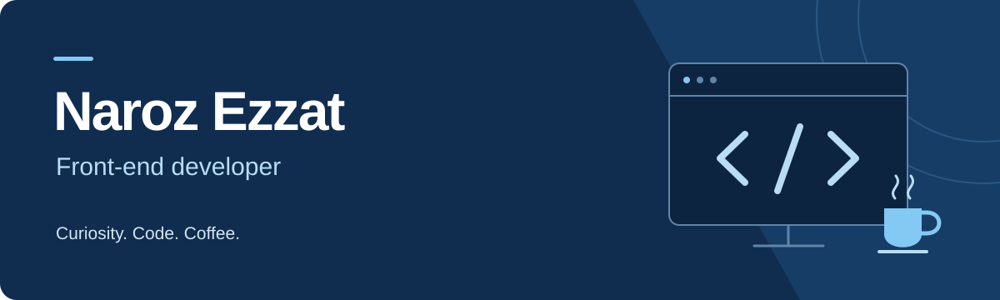

  

  <strong>Building for the web. Always learning.</strong> 
  JavaScript, React, and Next.js are at the heart of my work.

  <a href="https://naroz-ezzat.vercel.app/"><strong>Explore my portfolio</strong></a>
  &nbsp; / &nbsp;
  <a href="https://www.linkedin.com/in/naroz-ezzat-095370217/"><strong>Connect on LinkedIn</strong></a>
  &nbsp; / &nbsp;
  <a href="https://github.com/narozezzat?tab=repositories"><strong>Browse my code</strong></a>

## A little about me

I'm a front-end developer at **Sakneen** and an **ITI student**, exploring new
technologies and putting what I learn into practice.

I enjoy talking about **JavaScript, React, Next.js, Node.js**, and the details
that make web development interesting. Away from the keyboard, a good cup of
coffee is always part of my day.

## My toolkit

| Focus | Technologies |
| :--- | :--- |
| Front end | `JavaScript` · `React` · `Next.js` |
| Styling | `HTML5` · `CSS3` · `Sass` · `Bootstrap` |
| Back end & data | `Node.js` · `MongoDB` |
| Everyday tools | `Git` · `GitHub` · `Visual Studio Code` |

## Explore my work

**[Visit my portfolio](https://naroz-ezzat.vercel.app/)**  
Take a look at the projects I've worked on.

**[Explore my repositories](https://github.com/narozezzat?tab=repositories)**  
Browse the code and see what I've been building.

## Let's connect

Have a question about my work or want to talk web development?
**[Find me on LinkedIn](https://www.linkedin.com/in/naroz-ezzat-095370217/).**

---

Thanks for stopping by. There's always something new to learn.

